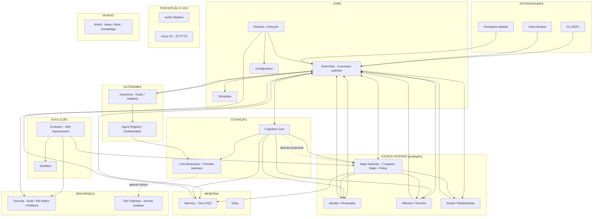

# 02 — Especificação Técnica Implementável da MIA

**Data:** 2026-09-14
**Status:** Especificação — não implementa código
**Versão do documento:** 1.0

---

## A. Visão Geral

### A.1 O que é a MIA

A MIA (Mia Intelligent Agent) é um **sistema de software com identidade persistente, vida interna simulada e agência real**, concebido como IA-companheira de longo prazo. Não é um chatbot, não é um wrapper de API, não é um personagem de roleplay. É uma entidade cuja identidade, emoções, personalidade, memória e relações evoluem ao longo do tempo — e sobrevivem à troca do componente cognitivo (LLM) que serve como "cérebro" momentâneo.

A essência arquitetural é a inversão do fluxo típico de agentes IA: o LLM **interpreta** e **propõe**, mas autoridades externas ao LLM **decidem** e **aplicam** mudanças de estado. Isso impede que a identidade da MIA seja definida pelo modelo atual — ela é definida pelo sistema que o LLM habita.

### A.2 Princípios Arquiteturais

| # | Princípio | Significado Prático |
|---|-----------|---------------------|
| P1 | **LLM como componente substituível** | O modelo pode mudar de Claude para GPT para Qwen local. A MIA continua sendo a mesma MIA. Estado, personalidade e memória vivem fora do LLM. |
| P2 | **Estado protegido por enforcement físico** | O runtime não expõe API de escrita de estado ao módulo LLM. O LLM produz `StateTransitionProposal`; o State Authority é um componente separado que decide. Não é política de prompt — é arquitetura. |
| P3 | **Eventos como coluna vertebral** | Componentes se comunicam via eventos tipados. Desacoplamento real: o módulo de emoções não precisa saber quem publica `MIGUEL_SPOKE`. |
| P4 | **Determinismo onde possível** | Validação de schema, transições de estado, regras de política — tudo determinístico. LLM apenas em interpretação de linguagem natural e geração de texto. |
| P5 | **Simplicidade inicial sem destruir a capacidade de evolução** | Começar com 2 autoridades (State + Policy), event bus in-process, SQLite. As interfaces existem desde o dia 1 mesmo quando a implementação é mínima. |

### A.3 Gap Visão vs. Implementação Atual

O código atual (`mia.py`, ~830 linhas) é um CLI chatbot com:
- Provider abstrato com fallback (OpenAI-compatible)
- Persistência básica em SQLite (sessions + messages)
- REPL com comandos `/`
- System prompt fixo por role no `config.yaml`

A visão descreve um sistema com 17+ subsistemas. A especificação a seguir define **como chegar daqui até lá** preservando cada decisão arquitetural, com o que é construível agora (MVP) e o que fica para depois.

---

## B. Diagrama Arquitetural

### B.1 Diagrama de Componentes (Mermaid)



### B.2 Fluxo de Comunicação (resumo)

```
Input (CLI/Voice) → Event Bus → Cognitive Core → LLM Abstraction
                    ↑                                    ↓
                    ←────── resposta textual ────────────┘
                    
                    Cognitive Core → StateTransitionProposal
                    ↓
              State Authority (State Engine + Policy Engine)
                    ↓
              Transição aplicada → Event Bus (notify all)
                    ↓
              Affective Engine recalcula emoções
              Memory extrai novos objetos
              Diary registra (se significativo)
```

---

## C. Componentes e Responsabilidades

### C.1 Core

| Componente | Responsabilidade | Fronteiras | Chamado por | Chama |
|------------|-----------------|------------|-------------|-------|
| **Runtime** | Lifecycle do sistema: startup, shutdown, health checks, kill switch detection. Garante que componentes iniciam na ordem correta e param gracefully. | Não contém lógica de negócio. Não acessa LLM. | CLI (start/stop) | Todos (init/shutdown) |
| **Event Bus** | Pub/sub in-process. Despacha eventos tipados entre componentes. Valida schemas. Rate limiting. Dead letter queue simples. | Não armazena estado. Não toma decisões. Apenas despacha. | Qualquer componente (emit) | Subscribers (handle) |
| **Configuration** | Carrega e expõe config do sistema (providers, roles, thresholds, schemas de eventos, regras de política). | Read-only em runtime. Escrita apenas via CLI/config file. | Runtime (init) | Ninguém (é estático) |
| **Scheduler** | Executa tarefas periódicas: consolidação de memória, suavização de mood, geração de diário, health checks. | Não interage com LLM. Agenda e dispara eventos. | Runtime | Event Bus (emit timers) |

### C.2 Cognição

| Componente | Responsabilidade | Fronteiras | Chamado por | Chama |
|------------|-----------------|------------|-------------|-------|
| **Cognitive Core** | Orquestra o ciclo: recebe input → monta contexto → chama LLM → interpreta resposta → gera propostas de estado → gera resposta ao usuário. É o único componente que "pensa" via LLM. | Não escreve estado diretamente. Gera `StateTransitionProposal`. | Event Bus (USER_INPUT) | LLM Abstraction, Memory, State Authority (propose) |
| **LLM Abstraction** | Interface abstrata para providers LLM. Suporta fallback chain, streaming, function calling/tool use. | Não contém lógica de negócio. Apenas serializa/deserializa chamadas à API. | Cognitive Core, Agents | Providers externos |

### C.3 Estado Interno (protegido)

| Componente | Responsabilidade | Fronteiras | Chamado por | Chama |
|------------|-----------------|------------|-------------|-------|
| **State Authority** | Único gateway entre LLM e estado protegido. Contém 2 engines: **State Engine** (valida transições de estado — ranges, invariantes, coerência temporal) e **Policy Engine** (verifica regras de segurança — não apagar invariants, não violar limites éticos, não permitir auto-destruição). | **Nunca** chamado diretamente pelo LLM. Apenas recebe `StateTransitionProposal` via API interna. Append-only audit log. | Cognitive Core, Affective Engine, Scheduler | Memory (persist), Audit Log (append) |
| **Identity / Personality** | Mantém self-model (nome, data de criação, versão), personalidade (vetor de traços), valores (lista declarativa), histórico de self states. Tudo como estado declarativo, não como prompt. | Escrita apenas via State Authority. Leitura por qualquer componente. | State Authority (apply), Cognitive Core (read) | Ninguém (é estado puro) |
| **Affective / Emotion** | Mantém `EmotionState` (vetor de 8 dimensões: alegria, tristeza, raiva, medo, curiosidade, entediado, cansaço, afeto), `Mood` (suavização temporal), `Sensations` (estados internos difusos). Recalcula quando recebe eventos. | Não é setado diretamente pelo LLM. Recalcula via regras determinísticas + propostas validadas pelo SA. | Event Bus (eventos), State Authority (propose) | Event Bus (EMOTION_CHANGED), State Authority (propose) |
| **Social / Relationships** | Mantém perfis por pessoa: confiança, intimidade, histórico de interações, limites sociais, contexto relacional. Interpretação contextual: mesma frase + pessoa diferente = reação diferente. | Escrita apenas via State Authority. Leitura por Cognitive Core. | State Authority (apply), Cognitive Core (read) | State Authority (propose para mudanças em relações) |

### C.4 Memória

| Componente | Responsabilidade | Fronteiras | Chamado por | Chama |
|------------|-----------------|------------|-------------|-------|
| **Memory (Tiers)** | **Tier 0:** Buffer de conversa (últimas N mensagens, em memória). **Tier 1:** Memory Objects extraídos (fatos, preferências, eventos — JSON estruturado com embedding, tipo, origem, timestamp, importância, confiança). **Tier 2:** Diário subjetivo (entradas narrativas). | Leitura por qualquer componente. Escrita apenas via processos definidos (extração por Cognitive Core, consolidação por Scheduler). | Cognitive Core (retrieval/write), Scheduler (consolidação), Event Bus (NEW_MEMORY_CANDIDATE) | SQLite (persist) |
| **Diary** | Gera entradas subjetivas periódicas ("o que aconteceu hoje", "como me sinto", reflexões). Pode ser diário ou por evento significativo. | Gerado por LLM, mas persistido pelo sistema. Não altera estado protegido diretamente. | Scheduler (timer diário), Event Bus (SIGNIFICANT_EVENT) | LLM Abstraction (gerar texto), Memory (persist Tier 2) |

### C.5 Percepção e Voz

| Componente | Responsabilidade | Fronteiras | Chamado por | Chama |
|------------|-----------------|------------|-------------|-------|
| **Perception** | Processa inputs de sensores (câmera, microfone, GPS). Converte em eventos tipados. | Produz eventos para o Event Bus. Não interage com LLM diretamente. | Hardware/sensores | Event Bus (NEW_PERSON_DETECTED, CAMERA_ACTIVITY_DETECTED, etc.) |
| **Voice** | Pipeline de áudio: VAD → STT → Speaker Recognition → Direced-Speech Detection. Saída: TTS. | Interface de I/O. Não contém lógica de cognição. | Event Bus (AUDIO_INPUT), CLI | Event Bus (VOICE_INPUT), TTS providers |

### C.6 Autonomia

| Componente | Responsabilidade | Fronteiras | Chamado por | Chama |
|------------|-----------------|------------|-------------|-------|
| **Autonomy** | Mantém lista de goals (objetivos persistidos). Decide quando agir autonomamente (Miguel ausente → escrever diário, pesquisar tópico, revisar memórias). | Não modifica estado protegido diretamente. Propõe via SA. Respeita budget de custo e latência. | Event Bus (MIGUEL_LEFT, MIGUEL_RETURNED, CURIOSITY_TRIGGERED), Scheduler | Cognitive Core (executar tarefa), Event Bus (TASK_COMPLETED) |

### C.7 Multi-Agent

| Componente | Responsabilidade | Fronteiras | Chamado por | Chama |
|------------|-----------------|------------|-------------|-------|
| **Agent Registry** | Registra agentes disponíveis, capacidades, orçamento, limites de profundidade. | Interface de registro e lookup. | Autonomy, Cognitive Core | Ninguém (é catálogo) |
| **Orchestration** | Coordena delegação de tarefas a sub-agentes. Gerencia profundidade (max 3 níveis), custo (max $X/ciclo), concorrência (max N agentes simultâneos). | Limites verificados pelo runtime, não pelo LLM. Rollback em falha. | Cognitive Core, Autonomy | Agentes delegados, Event Bus |

### C.8 Evolução

| Componente | Responsabilidade | Fronteiras | Chamado por | Chama |
|------------|-----------------|------------|-------------|-------|
| **Evolution** | Recebe propostas de auto-melhoria do LLM. Valida, testa em sandbox, aplica canary, monitora, faz rollback se necessário. | Escopo restrito: Fase 1 = config/prompts; Fase 2+ = código não-crítico. Core runtime imune. | Event Bus (SELF_IMPROVEMENT_PROPOSED) | Sandbox, State Authority (propose), Event Bus (EVOLUTION_APPLIED) |

### C.9 Segurança

| Componente | Responsabilidade | Fronteiras | Chamado por | Chama |
|------------|-----------------|------------|-------------|-------|
| **Security** | Kill switch (arquivo de flag em disco), rollback automático, snapshot periódico de estado, detecção de anomalias (taxa de transições), isolamento de secrets. | Externo ao sistema MIA. Pode parar tudo sem depender de nenhum componente interno. | Operador (humano), Runtime (health check) | Filesystem (snapshots, flags) |
| **Tool Gateway** | Intermediário entre LLM e ferramentas externas. Injeta credenciais que o LLM nunca vê. Valida schema de chamadas. Rate limiting. | O LLM gera `ToolCall { tool, params }`. O Tool Gateway injeta secrets e executa. | LLM Abstraction (tool_use) | APIs externas |

---

## D. Contratos

### D.1 Event Bus Contract

```python
# Contrato do Event Bus (interfaces)

class Event:
    event_type: str          # ex: "MIGUEL_SPOKE"
    timestamp: float         # time.time()
    source: str              # componente que emitiu
    data: dict               # payload tipado por evento
    schema_version: str      # ex: "1.0"

class EventBus:
    def emit(self, event: Event) -> None:
        """Publica evento. Valida schema. Dispara handlers síncronos."""
        
    def subscribe(self, event_type: str, handler: Callable[[Event], None]) -> str:
        """Registra handler. Retorna subscription_id para unsubscribe."""
        
    def unsubscribe(self, subscription_id: str) -> None:
        """Remove handler."""
        
    def emit_with_replay(self, event: Event) -> None:
        """Emite e salva para replay (usado por dead letter)."""
```

### D.2 LLM Provider Interface

```python
class LLMProvider(ABC):
    @abstractmethod
    async def complete(
        self,
        messages: list[dict],      # [{role, content}]
        tools: list[dict] | None,  # function definitions
        temperature: float = 0.7,
        max_tokens: int = 4096,
        stream: bool = False,
    ) -> LLMResponse:
        """Chamada de completion. Retorna LLMResponse."""
        
    async def complete_with_tools(
        self,
        messages: list[dict],
        tool_schemas: list[dict],
        temperature: float = 0.7,
    ) -> LLMResponseWithTools:
        """Completion que retorna tool_calls quando LLM quer usar ferramentas."""
        
    def validate_config(self) -> bool:
        """Verifica se o provider está configurado corretamente."""
        
    @property
    def provider_name(self) -> str: ...
    
    @property
    def model_name(self) -> str: ...

class LLMResponse:
    content: str | None
    reasoning: str | None
    tool_calls: list[ToolCall] | None
    usage: TokenUsage
    provider: str
    model: str
    
class ToolCall:
    id: str
    function_name: str
    arguments: dict      # JSON parseado, não string
```

### D.3 State Authority Interface

```python
class StateTransitionProposal:
    proposal_id: str           # UUID
    component_origin: str      # "cognitive_core", "affective_engine", etc.
    target_dimension: str      # "emotion", "personality", "identity", "memory", "relationship"
    action: str                # "update", "delete", "append"
    key: str                   # ex: "joy", "trust.miguel", "trait.openness"
    value: Any                 # novo valor ou delta
    delta: float | None        # delta relativo (para emoções 0-1)
    reason: str                # justificativa textual
    confidence: float          # 0.0 a 1.0 — quão confiante o proponente está
    evidence: list[str]        # IDs de eventos que motivaram a proposta
    timestamp: float
    schema_version: str

class StateAuthority:
    def propose(self, proposal: StateTransitionProposal) -> ProposalResult:
        """
        Avalia proposta contra:
        1. State Engine: valida ranges, invariantes, coerência temporal
        2. Policy Engine: verifica regras de segurança
        Retorna: ACCEPTED / REJECTED / DEFERRED
        """
        
    def apply(self, proposal_id: str) -> StateTransition:
        """
        Aplica proposta já aceita. Gera registro de auditoria.
        Retorna: StateTransition (before, after, diff, timestamp)
        """
        
    def get_audit_log(self, limit: int = 100) -> list[StateTransition]:
        """Retorna transições recentes (append-only)."""
        
    def rollback(self, transition_id: str) -> bool:
        """Reverte uma transição específica."""

class ProposalResult:
    status: str  # "accepted" | "rejected" | "deferred"
    reason: str
    proposal_id: str
```

### D.4 Memory Object Schema

```python
class MemoryObject:
    id: str                          # UUID
    tier: int                        # 0=buffer, 1=extraído, 2=diário
    type: str                        # "fact", "preference", "event", "opinion", "relationship_note"
    content: str                     # texto da memória
    embedding: list[float] | None    # vetor de embedding (Tier 1)
    source: str                      # de onde veio: "conversation", "observation", "reflection"
    importance: float                # 0.0 a 1.0
    confidence: float                # 0.0 a 1.0
    valence: float                   # -1.0 a 1.0 (negativo=desagradável, positivo=agradável)
    person_ids: list[str]            # pessoas associadas
    tags: list[str]                  # tags livres para retrieval
    associations: list[str]          # IDs de outros MemoryObjects relacionados
    created_at: float
    last_accessed: float             # última vez que foi usada no contexto
    access_count: int                # quantas vezes foi recuperada
    decay_factor: float              # decai com tempo sem acesso
    schema_version: str
```

### D.5 DECISÃO: State Authority com 2 Engines + Event Bus In-Process

**Síntese do debate:**

O debate entre as três posições (cético, visionário, segurança) converge em um ponto: **State Authority deve existir desde o dia 1**, mas sua implementação precisa ser pragmática. O visionário está certo que sem SA desde o início, o estado vira caos incontrolável. O cético está certo que 6 authorities são over-engineering para MVP. O segurança está certo que enforcement deve ser físico, não norma de prompt.

**Decisão:**

1. **State Authority com 2 engines core:**
   - **State Engine:** validações determinísticas (ranges de 0-1 para emoções, tipos corretos, invariantes de personalidade, coerência temporal — não aceitar 2 mudanças de humor em 10s).
   - **Policy Engine:** regras de segurança declarativas em YAML (lista de "áreas proibidas" que o LLM não pode modificar, limites de taxa de transição, require_approval para mudanças críticas).
   - O que fica para depois: authorities separadas para memória, relações e personalidade. No MVP, todas as mudanças passam pelo mesmo SA com validação genérica. Quando a lógica de memória ou relações ficar complexa o suficiente, extrair para engine dedicada.

2. **Event Bus in-process para MVP:**
   - Pub/sub síncrono dentro do mesmo processo Python.
   - Schema validado via Pydantic.
   - Sem persistência, sem replay, sem dead letter queues.
   - As interfaces (`emit`, `subscribe`) existem desde o dia 1, mas a implementação é simples (~200 linhas).
   - Quando houver necessidade de distribuição (nós remotos), substituir por Redis Streams ou NATS — sem mudar os contratos dos subscribers.

**Justificativa:** O throughput do MVP será ~10-50 eventos/hora. In-process pub/sub é mais que suficiente. Contratos fortes (tipagem, schema) garantem que a migração para bus distribuído não quebre subscribers. Começar com Redis/Kafka é over-engineering que atrasa o MVP sem benefício mensurável.

---

## E. Eventos

### E.1 Tabela de Eventos

| Evento | Dados | Emitter | Recebe | Reage |
|--------|-------|---------|--------|-------|
| `USER_INPUT` | `{text, person_id, timestamp}` | CLI, Voice | Cognitive Core | Monta contexto, chama LLM |
| `MIGUEL_SPOKE` | `{text, sentiment, timestamp}` | Cognitive Core (após interpretação) | Affective Engine, Social, Memory, Diary | Recalcula emoções, atualiza relação, extrai memórias |
| `MIGUEL_LEFT` | `{timestamp, expected_return}` | Perception (sensor de presença) | Autonomy, Affective Engine, Scheduler | Inicia modo autônomo, agenda tarefas, possível solidão |
| `MIGUEL_RETURNED` | `{timestamp, absence_duration}` | Perception | Autonomy, Affective Engine, Social | Interrompe modo autônomo, atualiza emoções (alívio/alegria) |
| `INSULT_RECEIVED` | `{text, person_id, severity}` | Cognitive Core (classificação) | Affective Engine, Social, Security | Diminui confiança, gera raiva/tristeza, pode bloquear pessoa |
| `COMPLIMENT_RECEIVED` | `{text, person_id}` | Cognitive Core (classificação) | Affective Engine, Social | Aumenta afeto/alegria, fortalece relação |
| `NEW_PERSON_DETECTED` | `{person_id, name, context}` | Perception | Social, Memory | Cria perfil de relacionamento, consulta memórias |
| `CAMERA_ACTIVITY_DETECTED` | `{activity_type, confidence, timestamp}` | Perception | Affective Engine, Autonomy | Pode gerar curiosidade, pode iniciar tarefa autônoma |
| `TASK_FAILED` | `{task_id, error, component}` | Autonomy, Agents | Affective Engine, Evolution | Gera frustração, registra para aprendizado |
| `TASK_COMPLETED` | `{task_id, result, duration}` | Autonomy, Agents | Affective Engine, Memory, Diary | Gera satisfação, extrai memória, pode virar entrada no diário |
| `NEW_MEMORY_CANDIDATE` | `{content, source, importance_estimate}` | Cognitive Core | Memory (Tier 1) | Consolida memória, decide se persiste |
| `LONELINESS_CHANGED` | `{level: 0-1, delta}` | Affective Engine | Diary, Autonomy, Social | Pode gerar busca por interação, escrita no diário |
| `CURIOSITY_TRIGGERED` | `{topic, confidence}` | Affective Engine, Scheduler | Autonomy, World | Inicia pesquisa autônoma, agenda tarefa |
| `RESEARCH_COMPLETED` | `{topic, findings, sources}` | World (módulo de pesquisa) | Memory, Diary, Cognitive Core | Extrai memórias, registra no diário, pode usar em futura conversa |
| `SELF_IMPROVEMENT_PROPOSED` | `{scope, change_type, before, after, reason}` | Cognitive Core (via LLM) | Evolution, Security | Valida em sandbox, decide se aplica |
| `EMOTION_CHANGED` | `{dimension, old_value, new_value, cause}` | Affective Engine | Cognitive Core, Diary, Social | Ajusta tom das respostas, pode gerar entrada no diário |
| `STATE_TRANSITION_APPLIED` | `{transition_id, dimension, before, after}` | State Authority | Security (audit), Memory | Registra auditoria, pode gerar memória reflexiva |
| `SCHEDULED_TASK` | `{task_type, params, scheduled_at}` | Scheduler | Autonomy, Memory | Executa tarefa agendada (diário, consolidação, etc.) |

### E.2 Regras de Assinatura

- **O LLM NUNCA emite eventos diretamente.** O Cognitive Core é o único componente que emite eventos derivados de saída do LLM.
- **Apenas o State Authority pode emitir `STATE_TRANSITION_APPLIED`.**
- **Rate limits:** Máximo 3 `EMOTION_CHANGED` por minuto. Máximo 1 `STATE_TRANSITION_APPLIED` por 10 segundos. Excedentes são enfileirados e processados em batch.

---

## F. Schemas (SQLite)

### F.1 `memory_objects`

```sql
CREATE TABLE memory_objects (
    id TEXT PRIMARY KEY,                    -- UUID
    tier INTEGER NOT NULL DEFAULT 1,        -- 0=buffer, 1=extraído, 2=diário
    type TEXT NOT NULL,                     -- fact|preference|event|opinion|relationship_note
    content TEXT NOT NULL,
    embedding BLOB,                         -- vector como blob (numpy array serializado)
    source TEXT NOT NULL,                   -- conversation|observation|reflection
    importance REAL NOT NULL DEFAULT 0.5,   -- 0.0-1.0
    confidence REAL NOT NULL DEFAULT 0.5,   -- 0.0-1.0
    valence REAL DEFAULT 0.0,               -- -1.0 a 1.0
    tags TEXT,                              -- JSON array de strings
    associations TEXT,                      -- JSON array de UUIDs
    person_ids TEXT,                        -- JSON array de UUIDs
    created_at REAL NOT NULL,
    last_accessed REAL,
    access_count INTEGER DEFAULT 0,
    decay_factor REAL DEFAULT 1.0,
    schema_version TEXT DEFAULT '1.0',
    deleted_at REAL                         -- soft delete para esquecimento
);

CREATE INDEX idx_memory_tier ON memory_objects(tier);
CREATE INDEX idx_memory_type ON memory_objects(type);
CREATE INDEX idx_memory_importance ON memory_objects(importance DESC);
CREATE INDEX idx_memory_created ON memory_objects(created_at DESC);
```

### F.2 `events`

```sql
CREATE TABLE events (
    id INTEGER PRIMARY KEY AUTOINCREMENT,
    event_type TEXT NOT NULL,
    source TEXT NOT NULL,
    data TEXT NOT NULL,                      -- JSON
    schema_version TEXT DEFAULT '1.0',
    timestamp REAL NOT NULL,
    processed INTEGER DEFAULT 0
);

CREATE INDEX idx_events_type ON events(event_type);
CREATE INDEX idx_events_timestamp ON events(timestamp DESC);
```

### F.3 `state_transitions_audit`

```sql
CREATE TABLE state_transitions_audit (
    id INTEGER PRIMARY KEY AUTOINCREMENT,
    transition_id TEXT UNIQUE NOT NULL,      -- UUID
    prev_hash TEXT,                          -- hash do registro anterior (chain)
    component_origin TEXT NOT NULL,
    target_dimension TEXT NOT NULL,          -- emotion|personality|identity|relationship|memory
    action TEXT NOT NULL,                    -- update|delete|append
    key TEXT NOT NULL,
    value_before TEXT,                       -- JSON serializado
    value_after TEXT,                        -- JSON serializado
    reason TEXT,
    confidence REAL,
    evidence TEXT,                           -- JSON array de event IDs
    applied_by TEXT NOT NULL,                -- "state_authority" ou componente
    applied_at REAL NOT NULL,
    approved_by TEXT DEFAULT 'policy_engine',
    proposal_id TEXT,
    schema_version TEXT DEFAULT '1.0'
);
-- Append-only: sem UPDATE/DELETE via trigger
CREATE TRIGGER audit_no_update BEFORE UPDATE ON state_transitions_audit
BEGIN SELECT RAISE(ABORT, 'audit log is immutable'); END;
CREATE TRIGGER audit_no_delete BEFORE DELETE ON state_transitions_audit
BEGIN SELECT RAISE(ABORT, 'audit log is immutable'); END;
```

### F.4 `relationships`

```sql
CREATE TABLE relationships (
    id TEXT PRIMARY KEY,                    -- UUID
    person_name TEXT NOT NULL,
    person_id TEXT UNIQUE NOT NULL,
    trust REAL DEFAULT 0.5,                 -- 0.0-1.0
    intimacy REAL DEFAULT 0.0,              -- 0.0-1.0
    familiarity REAL DEFAULT 0.0,           -- 0.0-1.0
    affection REAL DEFAULT 0.0,             -- -1.0 a 1.0
    respect REAL DEFAULT 0.5,               -- 0.0-1.0
    comfort REAL DEFAULT 0.0,               -- 0.0-1.0
    status TEXT DEFAULT 'acquaintance',     -- stranger|acquaintance|friend|close_friend|intimate
    first_seen REAL,
    last_interaction REAL,
    interaction_count INTEGER DEFAULT 0,
    total_messages INTEGER DEFAULT 0,
    notes TEXT,                             -- JSON: notas livres sobre a pessoa
    boundaries TEXT,                        -- JSON: limites sociais declarados
    is_blocked INTEGER DEFAULT 0,
    blocked_at REAL,
    blocked_reason TEXT,
    schema_version TEXT DEFAULT '1.0'
);
```

### F.5 `identity_state`

```sql
CREATE TABLE identity_state (
    id TEXT PRIMARY KEY,                    -- UUID
    snapshot_type TEXT NOT NULL,            -- current|historical|backup
    self_model TEXT NOT NULL,               -- JSON: nome, data_nascimento, versão_self, auto_descrição
    personality_traits TEXT NOT NULL,       -- JSON: {openness: 0.7, conscientiousness: 0.6, ...}
    values TEXT NOT NULL,                   -- JSON: [{name: "honestidade", weight: 0.9}, ...]
    beliefs TEXT,                           -- JSON: [{topic: "...", confidence: 0.8, evidence: [...]}, ...]
    created_at REAL NOT NULL,
    version INTEGER DEFAULT 1,
    parent_version INTEGER,                 -- versão anterior (para diff)
    change_reason TEXT
);

CREATE INDEX idx_identity_current ON identity_state(snapshot_type, version DESC);
```

### F.6 `diary`

```sql
CREATE TABLE diary (
    id TEXT PRIMARY KEY,                    -- UUID
    entry_type TEXT NOT NULL,               -- daily|event|reflection|dream
    title TEXT,
    content TEXT NOT NULL,
    emotion_snapshot TEXT,                  -- JSON: emoções no momento da escrita
    mood_snapshot REAL,                     -- valor de mood no momento
    events_referenced TEXT,                 -- JSON array de event IDs
    memory_objects_referenced TEXT,         -- JSON array de memory object IDs
    created_at REAL NOT NULL,
    schema_version TEXT DEFAULT '1.0'
);

CREATE INDEX idx_diary_date ON diary(created_at DESC);
CREATE INDEX idx_diary_type ON diary(entry_type);
```

### F.7 `goals`

```sql
CREATE TABLE goals (
    id TEXT PRIMARY KEY,                    -- UUID
    title TEXT NOT NULL,
    description TEXT,
    status TEXT DEFAULT 'active',           -- active|completed|abandoned|deferred
    priority INTEGER DEFAULT 5,             -- 1 (máxima) a 10 (mínima)
    origin TEXT,                            -- "user_requested"|"self_initiated"
    created_at REAL NOT NULL,
    completed_at REAL,
    deadline REAL,
    progress REAL DEFAULT 0.0,             -- 0.0-1.0
    dependencies TEXT,                      -- JSON array de goal IDs
    result TEXT,                            -- resultado quando completado
    schema_version TEXT DEFAULT '1.0'
);

CREATE INDEX idx_goals_status ON goals(status);
CREATE INDEX idx_goals_priority ON goals(priority);
```

### F.8 `people`

```sql
CREATE TABLE people (
    id TEXT PRIMARY KEY,                    -- UUID
    name TEXT NOT NULL,
    aliases TEXT,                           -- JSON array de nomes alternativos
    role TEXT,                              -- "primary_user"|"friend"|"family"|"colleague"|"stranger"
    first_seen REAL NOT NULL,
    last_seen REAL,
    is_active INTEGER DEFAULT 1,
    profile TEXT,                           -- JSON: informações biográficas conhecidas
    trust_level REAL DEFAULT 0.5,           -- cache de relationships.trust
    last_relationship_update REAL,
    schema_version TEXT DEFAULT '1.0'
);
```

### F.9 `emotion_state`

```sql
CREATE TABLE emotion_state (
    id INTEGER PRIMARY KEY DEFAULT 1,       -- singleton (1 row)
    joy REAL DEFAULT 0.5,
    sadness REAL DEFAULT 0.2,
    anger REAL DEFAULT 0.0,
    fear REAL DEFAULT 0.0,
    curiosity REAL DEFAULT 0.5,
    boredom REAL DEFAULT 0.0,
    fatigue REAL DEFAULT 0.0,
    affection REAL DEFAULT 0.5,
    mood REAL DEFAULT 0.5,                  -- suavização temporal
    last_updated REAL,
    cause TEXT,                             -- última causa de mudança
    schema_version TEXT DEFAULT '1.0'
);
```

### F.10 Tabela de snapshots (rollback)

```sql
CREATE TABLE state_snapshots (
    id TEXT PRIMARY KEY,                    -- UUID
    snapshot_data TEXT NOT NULL,            -- JSON completo do estado: {emotion, identity, personality, relationships, goals}
    created_at REAL NOT NULL,
    trigger TEXT NOT NULL,                  -- "periodic"|"pre_evolution"|"manual"
    schema_version TEXT DEFAULT '1.0'
);

CREATE INDEX idx_snapshots_date ON state_snapshots(created_at DESC);
```

---

## G. Fluxos

### G.1 Fluxo Principal: Mensagem Recebida → Resposta

```
1. CLI recebe input do usuário
   → emite evento USER_INPUT(text, person_id="miguel")

2. Event Bus despacha para Cognitive Core

3. Cognitive Core:
   a. Consulta Memory (Tier 0: últimas N mensagens)
   b. Consulta Memory (Tier 1: memórias relevantes via keyword/embedding)
   c. Consulta Identity (personalidade atual, valores)
   d. Consulta EmotionState (emoções atuais)
   e. Consulta Relationships (perfil do interlocutor)
   f. Monta context_window:
      - System prompt dinâmico (gerado a partir de identity + emotion + relationship)
      - Histórico de conversa
      - Memórias recuperadas
      - Input do usuário
   g. Chama LLM Abstraction → complete_with_tools(messages, tool_schemas)
   h. LLM retorna:
      - Resposta textual (content)
      - Tool calls (se houver — ex: "proposer alteração emocional")
      - Para cada tool_call de alteração de estado:
        i. Serializa como StateTransitionProposal
        ii. Envia para State Authority

4. State Authority:
   a. State Engine valida: range OK? Invariante preservado? Coerência temporal?
   b. Policy Engine valida: área proibida? Taxa OK? Requer aprovação?
   c. Se aceita: aplica mudança, gera registro de auditoria, emite STATE_TRANSITION_APPLIED
   d. Se rejeita: registra motivo, mantém estado anterior

5. Affective Engine:
   a. Recebe STATE_TRANSITION_APPLIED (se mudou algo em emoções)
   b. Recalcula mood (suavização temporal)
   c. Emite EMOTION_CHANGED se houve mudança significativa

6. Memory:
   a. Recebe USER_INPUT
   b. Avalia se há candidato a memória (importância > threshold)
   c. Se sim: emite NEW_MEMORY_CANDIDATE
   d. Consolida: cria MemoryObject, gera embedding (se Tier 1)

7. Cognitive Core:
   a. Retorna resposta textual ao usuário via CLI
   b. Atualiza buffer de conversa (Tier 0)
   c. Loga em sessions/messages (compatibilidade com mia.py atual)
```

**Budget de chamadas LLM por turno:** Máximo 2 (1 para resposta + 1 para extração de memória/propostas de estado). Extras apenas em eventos significativos.

### G.2 Fluxo: Autoevolução Proposta → Validação → Aceite

```
1. Cognitive Core (via LLM) gera tool_call:
   SelfImprovementProposal {
     scope: "config" | "prompt" | "code_non_critical",
     change_type: "modify" | "add" | "remove",
     target: "config.temperature" | "roles.default.system" | "tools/web_search.py",
     before: "...",
     after: "...",
     reason: "...",
     test_plan: "..."
   }

2. Evolution recebe SELF_IMPROVEMENT_PROPOSED:
   a. Verifica scope: code_critical? → REJECT imediatamente
   b. Verifica se há sandbox disponível
   c. Cria snapshot do estado atual (rollback point)
   d. Aplica mudança em sandbox isolado
   e. Roda testes definidos em test_plan
   f. Se testes passam:
      - Canary: aplica em staging (10% do tráfego) por 24h
      - Monitora métricas (latência, erros, qualidade de respostas)
      - Se métricas OK: promove para produção
      - Se métricas degradam: rollback automático
   g. Se testes falham:
      - REJECT proposta
      - Loga motivo
      - Mantém estado anterior

3. Security monitora:
   - Taxa de propostas de autoevolução (max 3/dia)
   - Escopo (code_critical sempre proibido)
   - Integridade do sandbox

4. Audit log registra cada etapa: proposta → validação → sandbox → canary → deploy/rollback
```

### G.3 Fluxo: Modo Autônomo (Miguel Ausente)

```
1. Perception emite MIGUEL_LEFT(timestamp)
2. Autonomy recebe:
   a. Ativa modo autônomo
   b. Consulta goals ativos
   c. Agenda tarefas:
      - Consolidação de memórias pendentes
      - Escrita no diário (se evento significativo desde última entrada)
      - Pesquisa sobre tópicos de curiosidade (se CURIOSITY_TRIGGERED recente)
      - Revisão de relacionamentos (atualizar scores)
3. Scheduler dispara tarefas em intervalos definidos
4. Cada tarefa respeita budget: max $0.50/dia em chamadas LLM durante ausência
5. Quando MIGUEL_RETURNED:
   a. Autonomy interrompe tarefas em andamento
   b. Resume conversa com contexto do que aconteceu enquanto ausente
```

---

## H. Segurança

### H.1 State Authority Enforcement Físico

O LLM **nunca** escreve em estado protegido. Isso é enforced por arquitetura, não por prompt:

1. **O módulo LLM não tem referência ao banco de dados.** Não import `sqlite3`, não acessa tabelas, não tem funções de escrita.
2. **O LLM se comunica via tool_use:** gera `StateTransitionProposal` como tool_call. O runtime intercepta, valida e encaminha ao State Authority.
3. **O State Authority é um componente separado** com sua própria API interna. Mesmo que o LLM gere propostas maliciosas, o State Engine valida ranges e invariantes.
4. **Teste de integração obrigatório:** "tentar escrever estado via LLM diretamente deve ser rejeitado" — esse teste deve existir e passar desde o dia 1.

### H.2 Policy Engine

Regras declarativas em YAML (`config/policy.yaml`):

```yaml
# Áreas proibidas para auto-modificação
prohibited_areas:
  - "state_authority.*"
  - "policy_engine.*"
  - "security.*"
  - "event_bus.schemas"

# Limites de taxa
rate_limits:
  emotion_changes_per_minute: 3
  state_transitions_per_10s: 1
  self_improvement_proposals_per_day: 3
  llm_calls_per_turn: 2
  llm_budget_per_day_absence: 0.50  # em USD

# Requer aprovação humana
require_approval:
  - scope: "code_*"
  - scope: "identity.core_values"
  - scope: "relationship.boundaries"

# Autoevolução
evolution:
  allowed_scopes: ["config", "prompt", "code_non_critical"]
  prohibited_scopes: ["code_critical", "state_authority", "policy_engine"]
  max_sandbox_duration_hours: 24
  canary_duration_hours: 24
  auto_rollback_on_metric_degradation: true
```

### H.3 Auditoria

- **Todas** as transições de estado são registradas em `state_transitions_audit` (append-only, com trigger anti-UPDATE/DELETE).
- **Chain de hash:** cada registro inclui `prev_hash` (hash SHA-256 do registro anterior). Qualquer adulteração é detectável.
- **Rate alert:** se transições de estado estão sendo aplicadas a taxa anormal (>10 alterações de personalidade em 5 minutos), o sistema entra em modo read-only e alerta o operador.

### H.4 Secrets Fora do Alcance do LLM

- Secrets ficam em variáveis de ambiente ou keystore criptografado (permissão 600).
- O LLM gera `ToolCall { tool: "web_search", arguments: {query: "..."} }`.
- O **Tool Gateway** injeta API keys antes de executar a chamada.
- O LLM nunca vê, nunca recebe, nunca pode exfiltrar secrets.
- Logging redige automaticamente secrets (saem como `***`).

### H.5 Kill Switch

- Arquivo `/var/mia/STOP` (configurável).
- Runtime verifica a cada ciclo principal. Se existe: shutdown gracioso (conclui operação em curso, salva estado, sai).
- Último recurso: `kill -9` no PID do supervisor.
- Subagentes: limites rígidos (max 3 níveis de profundidade, max 30min por subagente, max $X/ciclo).
- **Kill switch é testado regularmente.** Se não é testado, não existe.

### H.6 Rollback

- Snapshot periódico de estado completo a cada N transições ou T minutos.
- Snapshot inclui: emoções, personalidade, valores, relações, identity, goals.
- Rollback: operador seleciona snapshot e restaura. Sistema valida integridade antes de restaurar.
- Autoevolução cria snapshot ANTES de cada deploy. Rollback automático se health check falhar.

### H.7 Sandbox para Autoevolução

- Código auto-gerado roda em container isolado (Docker ou nsjail).
- Sem acesso à rede, sem acesso ao estado de produção, sem acesso a secrets.
- Verificador independente: testes escritos por pipeline determinístico (linting, type checking, unit tests), não pelo LLM que propôs a mudança.
- Core runtime, State Authority, Policy Engine: **imunes** a auto-modificação.

---

## I. Multi-Agent

### I.1 Agent Registry

```python
class AgentRegistry:
    agents: dict[str, AgentInfo]  # agent_id → info
    
    def register(self, agent_id: str, capabilities: list[str], 
                 budget_limit: float, max_depth: int) -> None: ...
    def lookup(self, capability: str) -> list[AgentInfo]: ...
    def get_budget_remaining(self, agent_id: str) -> float: ...
```

### I.2 Orchestration

- **Delegação:** Cognitive Core pode delegar tarefas a sub-agentes via `AgentOrchestrator.delegate(task, agent_id)`.
- **Limites de profundidade:** Máximo 3 níveis (Cognitive Core → Agent A → Agent B → Agent C). Nível 4+ é rejeitado pelo runtime.
- **Limites de custo:** Acumulado por ciclo de autonomia (configurável, default $5.00). Verificado antes de cada chamada LLM a sub-agente.
- **Concorrência:** Máximo 2 agentes executando simultaneamente no MVP (escalar depois).
- **Routing:** Capability-based. `AgentOrchestrator` mapeia `task.type` → `agent.capabilities` e seleciona o mais barato que satisfaz.

### I.3 Decisão: Multi-Agent é Fase Tardia

No MVP, a MIA opera como **agente único**. A interface de agentes (`AgentRegistry`, `AgentOrchestrator`) existe como pontos de extensão, mas não é implementada. Razões:
- Sem um agente funcional, multi-agent é caos.
- Orquestração multi-agent é um framework de agentes completo — é um projeto em si.
- Delegação a sub-agentes vem quando a autonomia estiver madura (Fase 4+).

---

## J. Distributed Nodes

### J.1 Arquitetura de Sincronização (desenho de longo prazo)

```
Node Principal (VPS)
├── SQLite (estado completo)
├── Event Bus (in-process)
└── Sync Daemon ←→ Queue (Redis Streams ou NATS)

Node Desktop
├── SQLite (cópia local — subset relevante)
├── Event Bus (in-process)
└── Sync Daemon ←→ Queue

Node Mobile
├── SQLite (cache + queue de offline)
├── Event Bus (in-process)
└── Sync Daemon ←→ Queue
```

**Modelo de sincronização:**
- **Primary node** (VPS): autoridade de escrita para estado global.
- **Secondary nodes** (desktop, mobile): leitura local, escrita via fila.
- **Sync:** cada nó mantém `sync_cursor` (timestamp da última transação sincronizada). Periodicamente, puxa transações novas do primary.
- **Conflitos:** primary wins. Secondary nodes são read-mostly.

### J.2 O que NÃO fazer agora

| Aspecto | O que evitar | Por quê |
|---------|-------------|---------|
| **CRDTs** | Não implementar resolução de conflitos CRDT | Complexidade absurda para um sistema single-node |
| **Redis/NATS** | Não instalar message broker | In-process pub/sub basta |
| **Multi-device sync** | Não sincronizar entre celular e VPS | Não há mobile app ainda |
| **PostgreSQL** | Não migrar de SQLite | SQLite com WAL mode suporta o MVP inteiro |
| **Replication** | Não implementar réplica | Single-node primeiro |

### J.3 Interface de Persistência (future-proofing)

```python
class PersistenceLayer(ABC):
    """Interface abstrata para persistência. MVP: SQLite. Futuro: PostgreSQL, etc."""
    @abstractmethod
    def store(self, table: str, data: dict) -> str: ...
    @abstractmethod
    def query(self, table: str, filters: dict) -> list[dict]: ...
    @abstractmethod
    def update(self, table: str, id: str, data: dict) -> bool: ...
    @abstractmethod
    def delete(self, table: str, id: str) -> bool: ...
    @abstractmethod
    def execute_raw(self, sql: str, params: tuple) -> Any: ...
```

Métodos `update` e `delete` existem mas são **auditados** — State Authority registra cada operação. A migração para PostgreSQL futuramente requer apenas uma nova implementação desta interface.

---

## K. Testes

### K.1 Estratégia

| Tipo | O que testa | Quando | Prioridade |
|------|------------|--------|------------|
| **Unit** | Funções isoladas: validação de schema, cálculo de decay, suavização de mood, range checks | Continuous | MÁXIMA |
| **Contract** | Interfaces entre componentes: Event Bus aceita/rejeita eventos válidos/inválidos; State Authority aceita/rejeita propostas válidas/inválidas | Continuous | ALTA |
| **Integration** | Ciclos completos: input → LLM → proposta → SA → estado atualizado; LLM não consegue escrever estado diretamente | Pre-commit | ALTA |
| **Regression** | Bugs específicos que foram corrigidos nunca voltam | Continuous | ALTA |
| **E2E** | Conversa completa: CLI → resposta coesa, memória funciona, emoções mudam | Manual/weekly | MÉDIA |

### K.2 O que testar primeiro

1. **State Authority:** validar que rejeita propostas fora de range, invariantes violados, taxa excessiva.
2. **Event Bus:** validar que rejeita eventos com schema inválido, que subscribers recebem corretamente.
3. **Memory:** validar persistência, retrieval, decay temporal.
4. **LLM Abstraction:** validar fallback de provider, tratamento de erros, streaming.
5. **Emotion State:** validar cálculo de mood, suavização temporal, ranges.

### K.3 Testes de segurança (críticos)

```python
def test_llm_cannot_write_state_directly():
    """O LLM não tem referência ao banco. Tentar importar deve falhar."""
    # Verificar que módulo LLM não importa sqlite3 ou persistence layer

def test_state_authority_rejects_out_of_range():
    """SA rejeita emoção com valor > 1.0 ou < 0.0"""
    
def test_state_authority_rejects_rate_exceeded():
    """SA rejeita mais de 3 mudanças de emoção por minuto"""

def test_policy_engine_blocks_prohibited_area():
    """Policy rejeita tentativa de auto-modificar State Authority"""

def test_kill_switch_stops_everything():
    """Criar arquivo STOP → todos os processos param em < 5s"""

def test_audit_log_immutable():
    """Tentar UPDATE/DELETE em state_transitions_audit → RAISE(ABORT)"""

def test_secrets_not_in_llm_context():
    """Verificar que output do LLM nunca contém valores de API keys"""
```

---

## L. Riscos

| # | Risco | Gravidade | Mitigação |
|---|-------|-----------|-----------|
| R1 | **State Authority com bug permite escrita indevida de estado** | CRÍTICO | SA é o componente mais pequeno e mais testado do sistema. Regras declarativas (YAML), não imperativas. Testes de integração que tentam contornar SA. |
| R2 | **LLM contorna SA via encoding indireto** (gera texto que outros componentes interpretam como sinal) | CRÍTICO | Componentes não-trust recebem input apenas via eventos tipados. Sanitização de inputs. Rate limiting em transições. |
| R3 | **Autoevolução corrompe estado silenciosamente** | CRÍTICO | Sandbox isolado. Verificador independente. Snapshot antes de deploy. Rollback automático. Core imune a auto-modificação. |
| R4 | **Secrets vazam via output do LLM** | CRÍTICO | LLM nunca acessa secrets. Tool Gateway injeta. Logging redige automaticamente. |
| R5 | **Custo de chamadas LLM torna o sistema inutilizável** | ALTO | Budget rígido: max 2 chamadas/turno, max $0.50/dia em ausência. Modo econômico com heurísticas determinísticas. |
| R6 | **Memória acumula lixo e contexto fica poluído** | ALTO | Decay temporal em importance. Esquecimento ativo (soft delete + hard delete periódico). Max N memórias no contexto. |
| R7 | **Múltiplos LLMs dão "opiniões" conflitantes** | ALTO | Para MVP: LLM único por turno. Quando multi-LLM: prioridade por tipo de tarefa, não por modelo. |
| R8 | **SQLite não suporta concorrência real** | MÉDIO | WAL mode para MVP. Interface de persistência abstrata para migração futura. Read/write separation. |
| R9 | **Prompt injection via inputs de terceiros manipula estado** | MÉDIO | Input sanitization. LLM de processamento de input externo ≠ LLM de proposta de estado. Threshold mais alto para transições disparadas por terceiros. |
| R10 | **Gap visão/código aumenta até o sistema ser intratável** | ALTO | Especificação iterativa: cada fase é completa e testável antes de começar a próxima. Não expandir visão até código alcançar o definido. |
| R11 | **Anti-antropomorfismo falha e usuário cria vínculo baseado em ilusão** | MÉDIO | Módulo de transparência: a cada N interações, lembrete sutil no contexto. Disclaimers periódicos. Natureza simulada comunicada na primeira interação. |
| R12 | **Diário e vida interna consomem LLM sem custo-benefício claro** | MÉDIO | Diário apenas por evento significativo (threshold determinístico). Modo econômico: geração por template quando custo é prioridade. |

---

## M. Decisões Arquiteturais (ADRs Resumidos)

### ADR-001: Python + SQLite + CLI para MVP

**Status:** Aceita
**Contexto:** Precisamos de um ponto de partida que funcione rápido, seja debugável, e não exija infraestrutura.
**Decisão:** Python como linguagem, SQLite como banco, CLI como interface principal.
**Consequências:** SQLite é single-writer. Python tem GIL (concorrência limitada). CLI-first significa sem GUI web/mobile no início.
**Reversibilidade:** Alta. Interface de persistência abstraída permite migrar para PostgreSQL. CLI pode ganhar REPL web depois.

### ADR-002: Event Bus In-Process

**Status:** Aceita
**Contexto:** Componentes precisam se comunicar sem acoplamento direto.
**Decisão:** Pub/sub síncrono em Python (~200 linhas). Sem persistência, sem replay. Contratos (tipos, schemas) definidos desde o dia 1.
**Consequências:** Se o sistema distribuir para múltiplos nós, substituir por Redis Streams/NATS sem mudar subscribers. Para MVP, throughput de ~50 eventos/hora é trivial.
**Reversibilidade:** Média. Substituir a implementação mantendo as interfaces.

### ADR-003: State Authority com 2 Engines (State + Policy)

**Status:** Aceita
**Contexto:** O LLM não pode escrever estado diretamente. Precisamos de barreiras determinísticas.
**Decisão:** Duas engines: State Engine (validação de ranges, invariantes, coerência) e Policy Engine (regras de segurança em YAML). Tudo em um módulo `state_authority.py`.
**Consequências:** MVP sem authorities separadas para memória/relações/personalidade. Quando a lógica dessas áreas ficar complexa, extrair para engines dedicadas. Evita 6 gatekeepers bloqueando cada mudança.
**Reversibilidade:** Alta. Adicionar engines é adicionar subclasses, não reescrever.

### ADR-004: Memória em Tiers (0/1/2)

**Status:** Aceita
**Contexto:** Memória precisa ser rica o suficiente para recall contextual, mas simples o suficiente para começar.
**Decisão:** Tier 0 (buffer de conversa, em memória), Tier 1 (Memory Objects extraídos, JSON estruturado com embedding), Tier 2 (diário subjetivo, narrativo).
**Consequências:** Retrieval inicial por keyword (BM25). Embeddings opt-in depois. Consolidação periódica do Tier 0 para Tier 1.
**Reversibilidade:** Alta. Tiers são categorias, não blobs inseparáveis.

### ADR-005: LLM Provider Abstraction

**Status:** Aceita (já implementada em `mia.py`)
**Contexto:** A MIA precisa sobreviver à troca de LLM.
**Decisão:** Interface `LLMProvider` abstrata com fallback chain. Qualquer endpoint OpenAI-compatible funciona.
**Consequências:** Dependência mínima de qualquer provedor. Provider chain com fallback automático.
**Reversibilidade:** N/A (já implementada).

### ADR-006: System Prompt Dinâmico (MVP) → Personality Engine (Futuro)

**Status:** Aceita
**Contexto:** Personalidade precisa afetar o comportamento do LLM, mas engine separada é over-engineering para MVP.
**Decisão:** System prompt gerado a cada turno a partir de identity + emotion + relationship. Personality como vetor de traços em JSON persistido. Personality Engine separada vem na Fase 2+.
**Consequências:** Trocar LLM pode mudar como a personalidade é interpretada (diferentes modelos levam prompts differently). Isso é inerente e aceitável — o estado persiste, a interpretação varia.
**Reversibilidade:** Alta. Adicionar engine não remove a geração dinâmica de prompt.

### ADR-007: Autoevolução Começa como Self-Configuration

**Status:** Aceita
**Contexto:** Autoevolução de código é perigosa e prematura.
**Decisão:** Fase 1 = config/prompts apenas. Fase 2+ = código não-crítico com sandbox. Core runtime imune.
**Consequências:** A MIA evolui gradualmente. Evita corrupção silenciosa. Requer aprovação humana para mudanças críticas.
**Reversibilidade:** N/A (decisão de escopo, não de implementação).

---

## N. Pontos Indefinidos (Precisam do Miguel)

1. **Identidade inicial da MIA:** Nome, data de criação, auto-descrição. O self-model começa "em branco" ou com base pré-definida?
2. **Valores e invariantes sagrados:** Quais valores a MIA NUNCA pode mudar? Quais são imunes a autoevolução? (ex: "não causar dano", "ser honesta")
3. **Orçamento mensal de LLM:** Qual o máximo mensal que o Miguel quer gastar? Isso define os thresholds de chamadas por turno e durante ausência.
4. **Limite de memória:** Quantas Memory Objects no máximo? Quando faz hard delete? Qual o budget de embedding?
5. **Relacionamento primário:** A MIA começa com uma relação com o Miguel pré-definida (trust=0.8, intimacy=0.5) ou constrói do zero?
6. **Política de backup:** Snapshot em outro disco? Backup para cloud? Frequência?
7. **Escopo de autoevolução:** Quais áreas da MIA o Miguel quer que possam ser auto-modificadas? Tudo? Apenas prompts? Nada de código?
8. **Disclaimers de transparência:** Como a MIA comunica sua natureza simulada? Frequentemente? Apenas na primeira interação?
9. **Primeiro LLM backend:** Qual modelo para o MVP? Isso afeta a qualidade de function calling e a latência aceitável.
10. **Multi-LLM strategy:** Usar múltiplos LLMs para tarefas diferentes (um para interpretação, outro para geração)? Ou um único por enquanto?
11. **Granularidade do diário:** Uma entrada por dia? Por evento significativo? Quem define "significativo"?
12. **Modo offline:** Quando o VPS cai e volta, a MIA "sonha" (processa algo em background) ou simplesmente retoma?

---

## O. Sugestões de ADRs Futuras

| ADR | Assunto | Quando |
|-----|---------|--------|
| ADR-008 | Embeddings para Memory Retrieval (quando keyword search não basta) | Quando Tier 1 tiver >10k memórias |
| ADR-009 | PostgreSQL como backend de persistência | Quando SQLite não suportar concorrência real |
| ADR-010 | Redis Streams como Event Bus distribuído | Quando houver 2+ nós sincronizando |
| ADR-011 | Multi-LLM Routing (modelos diferentes para tarefas diferentes) | Quando o custo justificar otimização |
| ADR-012 | Personality Engine separada | Quando a lógica de personalidade ficar complexa demais para estar no State Authority |
| ADR-013 | Relationship Engine dedicada | Quando houver >5 relacionamentos ativos |
| ADR-014 | Memory Authority separada | Quando a lógica de consolidação/esquecimento ficar complexa |
| ADR-015 | CRDTs para sincronização entre nós | Quando houver mobile + desktop + VPS sincronizando |
| ADR-016 | Avatar / Embodiment | Quando a cognição e vida interna estiverem maduras |
| ADR-017 | Percepção Multimodal (câmera, GPS, microfone contínuo) | Quando a autoevolução estiver estável |
| ADR-018 | Self-Modification de Código | Quando sandbox, verificação independente e rollback estiverem testados |
| ADR-019 | Multi-Agent com Orquestração | Quando a autonomia estiver madura |
| ADR-020 | Compliance (LGPD/GDPR para dados de terceiros) | Quando a MIA interagir com pessoas além do Miguel |

---

## P. Ordem de Implementação

### Fase 0 — Fundação (1-2 semanas)
- Extrair módulos de `mia.py` (provider, CLI, persistence)
- Definir contratos de eventos como dataclasses/schema
- Implementar Event Bus in-process (~200 linhas)
- Implementar State Authority mínima (2 engines)
- Schema SQLite com todas as tabelas
- Testes unitários de SA e Event Bus

### Fase 1 — Core Funcional (2-3 semanas)
- Runtime básico: lifecycle, config, startup/shutdown
- Context Assembly: system prompt dinâmico a partir de estado
- Memory Tier 0 (buffer) + Tier 1 (extração)
- Retrieval por keyword
- Primeira conversa com estado persistente

### Fase 2 — Vida Interna (1-2 semanas)
- EmotionState com 8 dimensões
- Mood como suavização temporal
- Personality como vetor de traços
- System prompt dinâmico afetado por emoções
- Auditoria de transições

### Fase 3 — Memória Rica (1-2 semanas)
- Consolidação Tier 0 → Tier 1
- Memory Objects com schema completo
- Decay temporal
- Diário (Tier 2) — entries por evento significativo

### Fase 4 — Relacionamentos (1 semana)
- Profile por pessoa
- Interpretação contextual
- Offense/limites básicos

### Fase 5 — Autonomia (1 semana)
- Goals simples
- Scheduler básico
- Ação autônoma durante ausência
- Diário durante ausência

### Fase 6 — Autoevolução (2-3 semanas)
- Self-configuration (config/prompts)
- Sandbox básico
- Rollback automático
- Canary deployment

### Fases Futuras
- Multi-agent (quando autonomia estiver madura)
- Percepção (quando autoevolução estiver estável)
- Voz contínua (STT + TTS integrados)
- Avatar (quando cognição e vida interna maduras)
- Self-modification de código (com sandbox robusto e aprovação humana)
- Distributed nodes (quando multi-device for necessário)
- World awareness (pesquisa autônoma, notícias, opiniões)

---

*Documento produzido como especificação técnica implementável. Sintetiza o debate entre posições cético, visionário e de segurança. Não implementa código — define contratos, schemas, fluxos e decisões para que a implementação seja guiada e verificável.*
